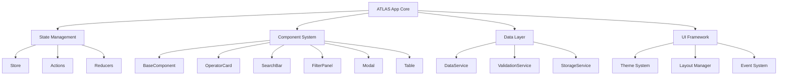

# ATLAS HTML v2.0 - Modernizovana Arhitektura

## 🎯 Pregled Projekta

ATLAS HTML v2.0 predstavlja potpunu modernizaciju postojeće aplikacije sa fokusom na modularnu arhitekturu, komponentni pristup i savremene web tehnologije.

---

## 📋 Analiza Postojećeg Sistema

### Trenutni Problemi
- **Monolitna struktura**: ATLASApp klasa od 589 linija
- **Tight coupling**: UI i business logika nisu razdvojeni
- **Nema SoC**: Separation of Concerns nije implementirana
- **Ručno DOM manipulacija**: Nema component abstraction
- **Nema reusability**: Komponente se ne mogu ponovo koristiti
- **Osnovni CSS**: Nema design sistem ili theme support

### Postojeće Prednosti
- **Funkcionalna aplikacija**: Sve osnovne CRUD operacije rade
- **LocalStorage integration**: Podatci se čuvaju lokalno
- **Responzivni dizajn**: Osnovna responsive funkcionalnost
- **JSON data management**: Strukturirani podaci

---

## 🏗️ Nova Modularna Arhitektura

### Arhitekturni Dijagram



### Ključni Principi
1. **Separation of Concerns** - Jasno razdvojene odgovornosti
2. **Component-Based Architecture** - Reusable UI komponenti
3. **Unidirectional Data Flow** - Predictable state management
4. **Mobile-First Design** - Responzivni pristup
5. **Progressive Enhancement** - PWA mogućnosti

---

## 🗂️ Nova Struktura Projekta

```
ATLAS-v2/
├── 📁 src/
│   ├── 📁 core/
│   │   ├── App.js                    # Main application controller  
│   │   ├── EventBus.js               # Global event system
│   │   └── Router.js                 # Client-side routing
│   │
│   ├── 📁 components/
│   │   ├── base/
│   │   │   ├── BaseComponent.js      # Abstract component class
│   │   │   ├── Modal.js              # Reusable modal
│   │   │   └── Table.js              # Enhanced table component
│   │   │
│   │   ├── layout/
│   │   │   ├── Header.js             # App header
│   │   │   ├── Sidebar.js            # Navigation sidebar
│   │   │   └── Footer.js             # App footer
│   │   │
│   │   └── operators/
│   │       ├── OperatorCard.js       # Operator display card
│   │       ├── OperatorForm.js       # Add/edit form
│   │       ├── OperatorTable.js      # Operators table
│   │       ├── SearchBar.js          # Search component
│   │       └── FilterPanel.js        # Advanced filters
│   │
│   ├── 📁 services/
│   │   ├── DataService.js            # Data management
│   │   ├── ValidationService.js      # Form validation
│   │   ├── StorageService.js         # LocalStorage wrapper
│   │   ├── ExportService.js          # Data export/import
│   │   └── NotificationService.js    # Toast notifications
│   │
│   ├── 📁 store/
│   │   ├── Store.js                  # Central state store
│   │   ├── actions.js                # State actions
│   │   └── reducers.js               # State reducers
│   │
│   ├── 📁 utils/
│   │   ├── helpers.js                # Utility functions
│   │   ├── constants.js              # App constants
│   │   └── validators.js             # Data validators
│   │
│   └── 📁 styles/
│       ├── 📁 base/
│       │   ├── reset.css             # CSS reset
│       │   ├── variables.css         # CSS custom properties
│       │   └── typography.css        # Typography system
│       │
│       ├── 📁 components/
│       │   ├── buttons.css           # Button styles
│       │   ├── forms.css             # Form styles
│       │   ├── tables.css            # Table styles
│       │   └── modals.css            # Modal styles
│       │
│       ├── 📁 layout/
│       │   ├── grid.css              # CSS Grid system
│       │   ├── header.css            # Header layout
│       │   └── responsive.css        # Media queries
│       │
│       └── 📁 themes/
│           ├── light.css             # Light theme
│           ├── dark.css              # Dark theme
│           └── theme-switcher.css    # Theme switching
│
├── 📁 assets/
│   ├── 📁 icons/                     # SVG icons
│   ├── 📁 images/                    # Images
│   └── 📁 fonts/                     # Custom fonts
│
├── 📁 data/
│   ├── operators.json                # Enhanced operator data
│   ├── categories.json               # Operator categories
│   └── schema.json                   # Data validation schema
│
├── 📁 tests/
│   ├── 📁 unit/                      # Unit tests
│   ├── 📁 integration/               # Integration tests
│   └── test-runner.html              # Test runner
│
├── 📁 docs/
│   ├── ARCHITECTURE.md               # Architecture documentation
│   ├── COMPONENTS.md                 # Component documentation
│   └── API.md                        # Internal API docs
│
├── index.html                        # Main entry point
├── manifest.json                     # PWA manifest
├── service-worker.js                 # Service worker for PWA
└── package.json                      # Dependencies (optional)
```

---

## 🧩 Ključne Komponente

### 1. State Management System

```javascript
// store/Store.js
class Store {
    constructor() {
        this.state = {
            operators: [],
            filters: {
                search: '',
                category: '',
                status: '',
                priority: ''
            },
            ui: {
                loading: false,
                currentView: 'table',
                theme: 'light',
                sidebarOpen: false
            },
            user: {
                preferences: {
                    itemsPerPage: 20,
                    defaultSort: 'name'
                }
            }
        };
        this.subscribers = [];
        this.middleware = [];
    }
    
    dispatch(action) {
        const prevState = { ...this.state };
        this.state = this.reduce(this.state, action);
        this.notifySubscribers(prevState, this.state, action);
    }
    
    subscribe(callback) {
        this.subscribers.push(callback);
        return () => {
            this.subscribers = this.subscribers.filter(sub => sub !== callback);
        };
    }
}
```

### 2. Component System

```javascript
// components/base/BaseComponent.js
class BaseComponent {
    constructor(element, options = {}) {
        this.element = typeof element === 'string' 
            ? document.querySelector(element) 
            : element;
        this.options = { ...this.defaultOptions, ...options };
        this.state = {};
        this.events = new Map();
        this.children = new Set();
        
        this.init();
    }
    
    // Abstract methods
    init() {}
    render() {}
    destroy() {
        this.removeAllListeners();
        this.children.forEach(child => child.destroy());
    }
    
    // Event system
    on(event, callback) {
        if (!this.events.has(event)) {
            this.events.set(event, new Set());
        }
        this.events.get(event).add(callback);
    }
    
    emit(event, data) {
        if (this.events.has(event)) {
            this.events.get(event).forEach(callback => callback(data));
        }
    }
    
    // State management
    setState(newState) {
        this.state = { ...this.state, ...newState };
        this.render();
    }
}
```

### 3. Data Service Layer

```javascript
// services/DataService.js
class DataService {
    constructor() {
        this.storage = new StorageService();
        this.validator = new ValidationService();
        this.cache = new Map();
    }
    
    async getOperators(filters = {}) {
        const cacheKey = JSON.stringify(filters);
        
        if (this.cache.has(cacheKey)) {
            return this.cache.get(cacheKey);
        }
        
        let operators = await this.storage.getOperators();
        
        // Apply filters
        if (filters.search) {
            operators = this.filterBySearch(operators, filters.search);
        }
        if (filters.category) {
            operators = this.filterByCategory(operators, filters.category);
        }
        if (filters.status) {
            operators = this.filterByStatus(operators, filters.status);
        }
        
        this.cache.set(cacheKey, operators);
        return operators;
    }
    
    async saveOperator(operatorData) {
        const validation = this.validator.validateOperator(operatorData);
        if (!validation.isValid) {
            throw new ValidationError(validation.errors);
        }
        
        const operator = await this.storage.saveOperator(operatorData);
        this.invalidateCache();
        return operator;
    }
}
```

---

## 🎨 Design System

### Color Palette

```css
/* Primary Colors */
:root {
    --atlas-blue: #1e40af;
    --atlas-blue-light: #3b82f6;
    --atlas-blue-dark: #1e3a8a;
    
    /* Semantic Colors */
    --success: #10b981;
    --warning: #f59e0b;  
    --error: #ef4444;
    --info: #06b6d4;
    
    /* Neutral Colors */
    --gray-50: #f9fafb;
    --gray-100: #f3f4f6;
    --gray-200: #e5e7eb;
    --gray-300: #d1d5db;
    --gray-400: #9ca3af;
    --gray-500: #6b7280;
    --gray-600: #4b5563;
    --gray-700: #374151;
    --gray-800: #1f2937;
    --gray-900: #111827;
}
```

### Typography System

```css
/* Font Stack */
:root {
    --font-primary: 'Inter', -apple-system, BlinkMacSystemFont, 'Segoe UI', sans-serif;
    --font-mono: 'Fira Code', 'SF Mono', 'Monaco', 'Cascadia Code', monospace;
    
    /* Type Scale */
    --text-xs: 0.75rem;      /* 12px */
    --text-sm: 0.875rem;     /* 14px */
    --text-base: 1rem;       /* 16px */
    --text-lg: 1.125rem;     /* 18px */
    --text-xl: 1.25rem;      /* 20px */
    --text-2xl: 1.5rem;      /* 24px */
    --text-3xl: 1.875rem;    /* 30px */
    --text-4xl: 2.25rem;     /* 36px */
    
    /* Font Weights */
    --font-light: 300;
    --font-normal: 400;
    --font-medium: 500;
    --font-semibold: 600;
    --font-bold: 700;
}
```

### Spacing System

```css
:root {
    /* Spacing Scale (8pt grid) */
    --space-0: 0;
    --space-1: 0.25rem;    /* 4px */
    --space-2: 0.5rem;     /* 8px */
    --space-3: 0.75rem;    /* 12px */
    --space-4: 1rem;       /* 16px */
    --space-5: 1.25rem;    /* 20px */
    --space-6: 1.5rem;     /* 24px */
    --space-8: 2rem;       /* 32px */
    --space-10: 2.5rem;    /* 40px */
    --space-12: 3rem;      /* 48px */
    --space-16: 4rem;      /* 64px */
    --space-20: 5rem;      /* 80px */
}
```

---

## 📱 Responsive Design

### Breakpoints

```css
:root {
    /* Mobile First Approach */
    --breakpoint-sm: 640px;   /* Small devices (phones) */
    --breakpoint-md: 768px;   /* Medium devices (tablets) */
    --breakpoint-lg: 1024px;  /* Large devices (laptops) */
    --breakpoint-xl: 1280px;  /* Extra large devices (desktops) */
    --breakpoint-2xl: 1536px; /* Extra extra large screens */
}
```

### Grid System

```css
.container {
    width: 100%;
    margin: 0 auto;
    padding: 0 var(--space-4);
}

@media (min-width: 640px) {
    .container { max-width: 640px; }
}

@media (min-width: 768px) {
    .container { max-width: 768px; }
}

@media (min-width: 1024px) {
    .container { max-width: 1024px; }
}

@media (min-width: 1280px) {
    .container { max-width: 1280px; }
}
```

---

## 🔧 Ključne Funkcionalnosti

### 1. Enhanced Data Management
- **Advanced CRUD**: Batch operations, undo/redo
- **Data validation**: JSON Schema based validation
- **Import/Export**: JSON, CSV, Excel format support  
- **Data versioning**: Track changes over time
- **Conflict resolution**: Handle concurrent edits

### 2. Modern UI/UX
- **Card-based layout**: Intuitive operator display
- **Advanced search**: Autocomplete, fuzzy search
- **Multi-level filtering**: Category, status, priority filters
- **Drag & drop**: Sortiranje i organizacija
- **Infinite scroll**: Performance optimized loading
- **Dark/Light themes**: User preference support
- **Keyboard navigation**: Full accessibility support

### 3. Performance Optimizations
- **Virtual scrolling**: Handle 1000+ items efficiently
- **Lazy loading**: Load components on demand
- **Debounced search**: Optimize search performance
- **Memoization**: Cache expensive calculations
- **Service Worker**: Cache resources for offline use
- **Code splitting**: Load only necessary code

### 4. PWA Capabilities
- **Offline support**: Work without internet connection
- **App-like experience**: Native app feel
- **Push notifications**: Real-time updates
- **Background sync**: Sync data when online
- **Install prompt**: Add to home screen

---

## 🧪 Testing Strategy

### Unit Testing
```javascript
// tests/unit/components/OperatorCard.test.js
describe('OperatorCard Component', () => {
    test('renders operator data correctly', () => {
        const operator = {
            id: 1,
            naziv: 'BH Telecom',
            tip: 'Dominantni operater'
        };
        
        const card = new OperatorCard('#test-element', { operator });
        expect(card.element.textContent).toContain('BH Telecom');
    });
});
```

### Integration Testing
```javascript
// tests/integration/DataService.test.js
describe('DataService Integration', () => {
    test('filters operators correctly', async () => {
        const service = new DataService();
        const operators = await service.getOperators({
            category: 'dominantni',
            status: 'aktivan'
        });
        
        expect(operators.length).toBeGreaterThan(0);
        expect(operators.every(op => op.status === 'aktivan')).toBe(true);
    });
});
```

---

## 🚀 Implementation Roadmap

### Phase 1 - Foundation (Week 1)
- [ ] Setup project structure i development environment
- [ ] Implementacija Base Component sistema
- [ ] Kreiranje Store i state management
- [ ] Osnovni CSS architecture sa design tokens
- [ ] Router i navigation sistem

### Phase 2 - Core Features (Week 2)  
- [ ] Operator management komponenti (Card, Form, Table)
- [ ] Search i filtering sistem sa advanced opcijama
- [ ] Data services implementacija (CRUD, validation)
- [ ] Responsive layout sa CSS Grid
- [ ] Theme system (light/dark mode)

### Phase 3 - Advanced Features (Week 3)
- [ ] PWA implementacija (manifest, service worker)
- [ ] Performance optimizacije (virtual scrolling, lazy loading)
- [ ] Advanced search (autocomplete, fuzzy search)
- [ ] Import/Export funkcionalnosti
- [ ] Accessibility improvements

### Phase 4 - Polish & Deploy (Week 4)
- [ ] Comprehensive testing (unit, integration, E2E)
- [ ] Performance tuning i optimizacije
- [ ] Documentation i developer guides
- [ ] Production build setup
- [ ] Deployment pripreme

---

## 🎯 Očekivani Benefiti

### Developer Experience
✅ **Maintainable Code** - Modularni pristup lakši za održavanje  
✅ **Clear Separation** - Jasno razdvojene odgovornosti  
✅ **Reusable Components** - DRY princip u praksi  
✅ **Type Safety** - JSDoc ili TypeScript integration  
✅ **Testing Framework** - Comprehensive test coverage  

### User Experience  
✅ **Fast Performance** - Optimizovano za brzinu  
✅ **Responsive Design** - Savršeno na svim uređajima  
✅ **Intuitive UI** - Moderna, user-friendly interface  
✅ **Offline Support** - Radi bez internet konekcije  
✅ **Accessibility** - Pristupačno svim korisnicima  

### Business Value
✅ **Scalability** - Lako dodavanje novih funkcionalnosti  
✅ **Future-proof** - Moderni web standards  
✅ **Low Maintenance** - Manje tehničkog duga  
✅ **Better UX** - Poboljšano korisničko iskustvo  
✅ **Mobile-first** - Optimizovano za mobilne uređaje  

---

## 📞 Next Steps

1. **Approval** - Odobravanje arhitekture i plana
2. **Setup** - Kreiranje development environment-a
3. **Implementation** - Početak development ciklusa prema roadmap-u
4. **Iterative Development** - Agile pristup sa weekly reviews
5. **Testing & QA** - Continuous testing tokom development-a

---

**Dokument verzija**: 1.0  
**Datum kreiranja**: 31. jul 2025  
**Autor**: ATLAS Architecture Team  
**Status**: Čeka odobravanje 📋