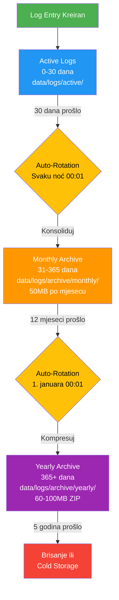
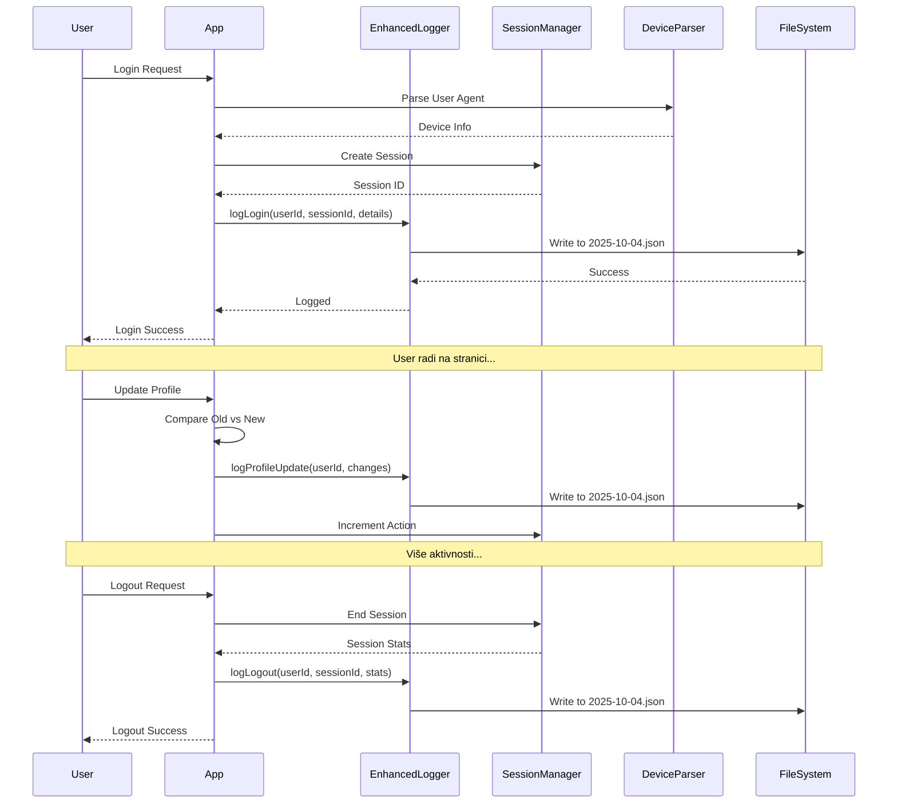
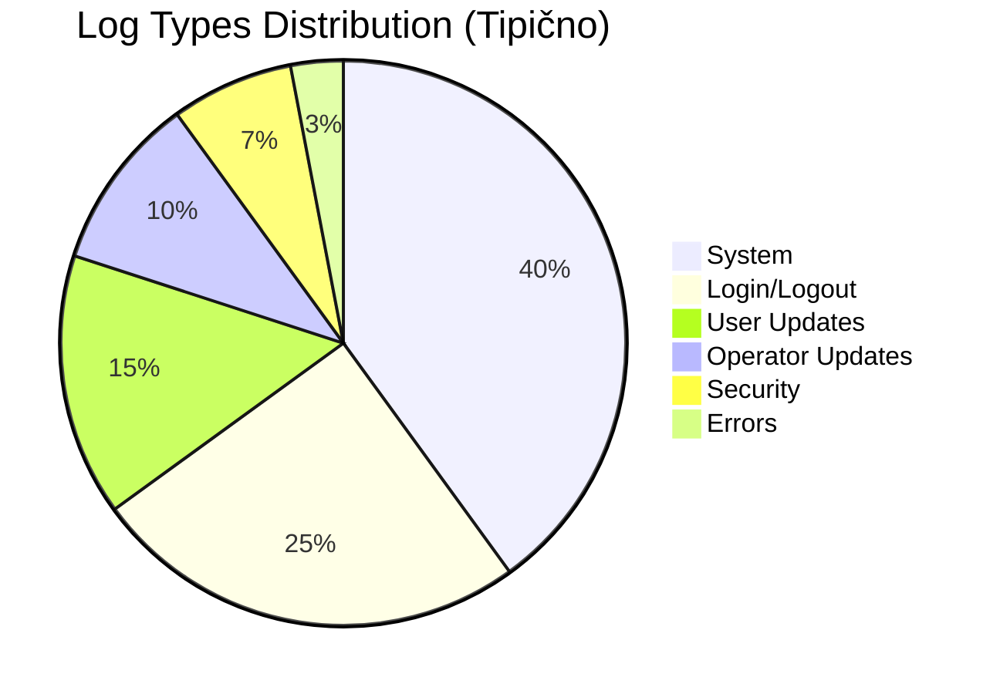
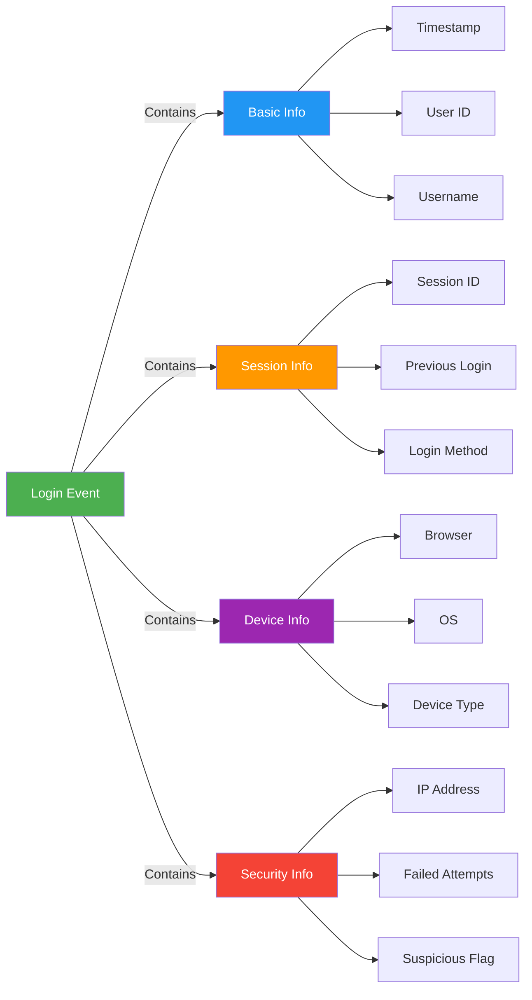
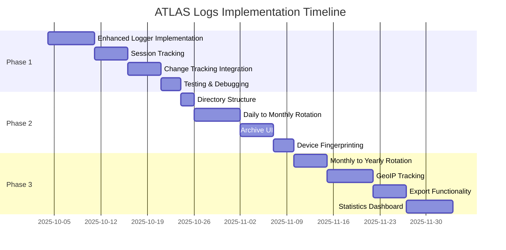
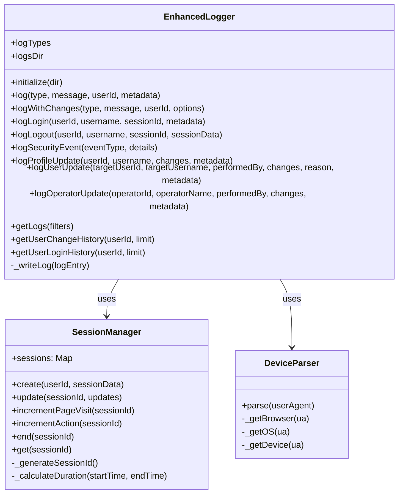
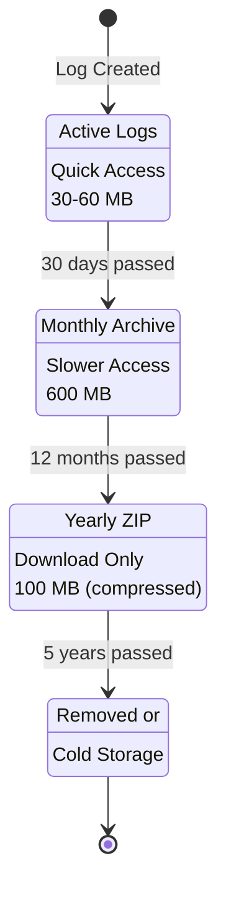

```mermaid
graph TB
    Start[Log Entry Kreiran] --> Active[Active Logs<br/>0-30 dana<br/>data/logs/active/]
    
    Active -->|30 dana prošlo| Rotation1{Auto-Rotation<br/>Svaku noć 00:01}
    
    Rotation1 -->|Konsoliduj| Monthly[Monthly Archive<br/>31-365 dana<br/>data/logs/archive/monthly/<br/>50MB po mjesecu]
    
    Monthly -->|12 mjeseci prošlo| Rotation2{Auto-Rotation<br/>1. januara 00:01}
    
    Rotation2 -->|Kompresuj| Yearly[Yearly Archive<br/>365+ dana<br/>data/logs/archive/yearly/<br/>60-100MB ZIP]
    
    Yearly -->|5 godina prošlo| Delete[Brisanje ili<br/>Cold Storage]
    
    style Start fill:#4CAF50,color:#fff
    style Active fill:#2196F3,color:#fff
    style Monthly fill:#FF9800,color:#fff
    style Yearly fill:#9C27B0,color:#fff
    style Delete fill:#f44336,color:#fff
    style Rotation1 fill:#FFC107,color:#000
    style Rotation2 fill:#FFC107,color:#000
```

---

```mermaid
sequenceDiagram
    participant U as User
    participant A as App
    participant L as EnhancedLogger
    participant S as SessionManager
    participant D as DeviceParser
    participant F as FileSystem

    U->>A: Login Request
    A->>D: Parse User Agent
    D-->>A: Device Info
    A->>S: Create Session
    S-->>A: Session ID
    A->>L: logLogin(userId, sessionId, details)
    L->>F: Write to 2025-10-04.json
    F-->>L: Success
    L-->>A: Logged
    A-->>U: Login Success

    Note over U,F: User radi na stranici...

    U->>A: Update Profile
    A->>A: Compare Old vs New
    A->>L: logProfileUpdate(userId, changes)
    L->>F: Write to 2025-10-04.json
    A->>S: Increment Action
    
    Note over U,F: Više aktivnosti...

    U->>A: Logout Request
    A->>S: End Session
    S-->>A: Session Stats
    A->>L: logLogout(userId, sessionId, stats)
    L->>F: Write to 2025-10-04.json
    A-->>U: Logout Success
```

---

```mermaid
pie title Log Types Distribution (Tipično)
    "System" : 40
    "Login/Logout" : 25
    "User Updates" : 15
    "Operator Updates" : 10
    "Security" : 7
    "Errors" : 3
```

---

```mermaid
graph LR
    A[Login Event] -->|Contains| B[Basic Info]
    A -->|Contains| C[Session Info]
    A -->|Contains| D[Device Info]
    A -->|Contains| E[Security Info]
    
    B --> B1[Timestamp]
    B --> B2[User ID]
    B --> B3[Username]
    
    C --> C1[Session ID]
    C --> C2[Previous Login]
    C --> C3[Login Method]
    
    D --> D1[Browser]
    D --> D2[OS]
    D --> D3[Device Type]
    
    E --> E1[IP Address]
    E --> E2[Failed Attempts]
    E --> E3[Suspicious Flag]
    
    style A fill:#4CAF50,color:#fff
    style B fill:#2196F3,color:#fff
    style C fill:#FF9800,color:#fff
    style D fill:#9C27B0,color:#fff
    style E fill:#f44336,color:#fff
```

---

```mermaid
gantt
    title ATLAS Logs Implementation Timeline
    dateFormat  YYYY-MM-DD
    section Phase 1
    Enhanced Logger Implementation    :a1, 2025-10-04, 7d
    Session Tracking                  :a2, after a1, 5d
    Change Tracking Integration       :a3, after a2, 5d
    Testing & Debugging               :a4, after a3, 3d
    
    section Phase 2
    Directory Structure               :b1, after a4, 2d
    Daily to Monthly Rotation         :b2, after b1, 7d
    Archive UI                        :b3, after b2, 5d
    Device Fingerprinting             :b4, after b3, 3d
    
    section Phase 3
    Monthly to Yearly Rotation        :c1, after b4, 5d
    GeoIP Tracking                    :c2, after c1, 7d
    Export Functionality              :c3, after c2, 5d
    Statistics Dashboard              :c4, after c3, 7d
```

---

```mermaid
classDiagram
    class EnhancedLogger {
        +logTypes
        +logsDir
        +initialize(dir)
        +log(type, message, userId, metadata)
        +logWithChanges(type, message, userId, options)
        +logLogin(userId, username, sessionId, metadata)
        +logLogout(userId, username, sessionId, sessionData)
        +logSecurityEvent(eventType, details)
        +logProfileUpdate(userId, username, changes, metadata)
        +logUserUpdate(targetUserId, targetUsername, performedBy, changes, reason, metadata)
        +logOperatorUpdate(operatorId, operatorName, performedBy, changes, metadata)
        +getLogs(filters)
        +getUserChangeHistory(userId, limit)
        +getUserLoginHistory(userId, limit)
        -_writeLog(logEntry)
    }
    
    class SessionManager {
        +sessions: Map
        +create(userId, sessionData)
        +update(sessionId, updates)
        +incrementPageVisit(sessionId)
        +incrementAction(sessionId)
        +end(sessionId)
        +get(sessionId)
        -_generateSessionId()
        -_calculateDuration(startTime, endTime)
    }
    
    class DeviceParser {
        +parse(userAgent)
        -_getBrowser(ua)
        -_getOS(ua)
        -_getDevice(ua)
    }
    
    EnhancedLogger --> SessionManager : uses
    EnhancedLogger --> DeviceParser : uses
```

---

```mermaid
stateDiagram-v2
    [*] --> Active: Log Created
    Active --> Monthly: 30 days passed
    Monthly --> Yearly: 12 months passed
    Yearly --> Deleted: 5 years passed
    Deleted --> [*]
    
    Active : Active Logs
    Active : Quick Access
    Active : 30-60 MB
    
    Monthly : Monthly Archive
    Monthly : Slower Access
    Monthly : 600 MB
    
    Yearly : Yearly ZIP
    Yearly : Download Only
    Yearly : 100 MB (compressed)
    
    Deleted : Removed or
    Deleted : Cold Storage
```
